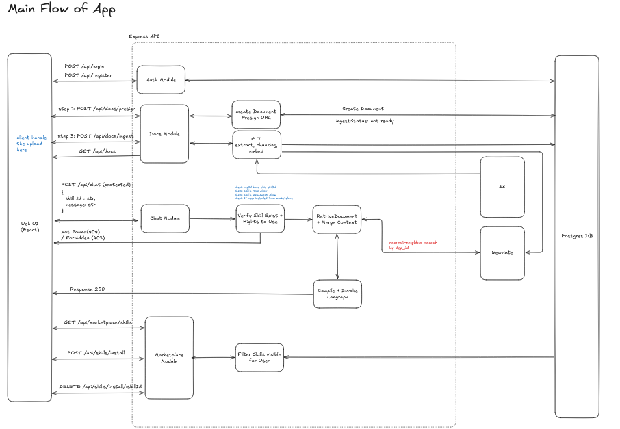

# AI Marketplace Platform - Place to share skills between departments in organization

Monorepo for an internal-style **AI marketplace**: JWT auth, org-scoped **prompt nodes** and **skills** (ordered workflows), **marketplace** listing, **document upload + RAG** (S3/MinIO, Weaviate, embeddings), and **chat** that runs installed skills.

### My Concept

### Nodes & Skills
Users build nodes, which are individual prompt templates (e.g., "summarize this document" or "extract action items"). Nodes can be chained together into skills — ordered workflows where the output of one step feeds into the next. Skills are published to a marketplace where other users in the org can discover and install them.

### Chat Interface
Once a user installs a skill, they can invoke it through a chat interface. The backend runs the skill’s ordered steps via **`runSkill`** in `apps/api/src/lib/agent/runtime.ts`: a **LangGraph `StateGraph`** is compiled per request (linear edges today), with one **LangChain `ChatOpenAI`** call per prompt node. If the document pipeline is enabled, a synthetic **`retrieve_documents`** step runs first and fills `{{context}}` from Weaviate.

### Document RAG Pipeline
Users can upload documents (PDFs, CSVs, etc.) which get chunked, embedded via an **OpenAI-compatible embeddings API** (see `.env.example`), and stored in Weaviate. When chatting, retrieval uses the same pipeline with a higher chunk **limit** than the standalone docs query UI.

### Access Control & Marketplace
Skills and nodes can be restricted by **role** and **department**. The marketplace lists org skills for everyone, but users who **fail** the skill’s allow lists get a **locked** card: **`detail_hidden`** is true and **name, description, and node list are omitted** (they still see coarse access hints such as `access_summary`).

### Tech stack (summary)
React + TypeScript frontend, Express + Prisma + PostgreSQL backend, **LangChain** for LLM/embeddings clients, **LangGraph** for the per-request skill runtime graph, Weaviate for vectors, S3/MinIO for file storage, JWT for auth.

Behavior is defined by the code; for a route-by-route picture see **`docs/spec.md`**.

## Architecture



## Visibility rules

- **Skills (builder / “visible” list):** `skill.orgId` must match **`effectiveOrgId`** (`user.orgId ?? user.userId`), and the user must pass the skill’s **`allowRole`** / **`allowDepartment`** lists (`userMatchesAllowLists`). An **empty** allow list on an axis means **no restriction** on that axis.
- **Marketplace:** Every default-org skill is returned, each with **`accessible: true|false`**. If false, the response **redacts** name, description, and nodes (`detail_hidden: true`).
- **Nodes (`GET /api/nodes`):** Only nodes in the user’s **`effectiveOrgId`** scope; each row is then filtered by that node’s own allow lists.
- **Install & chat:** **`POST /api/skills/install`** re-checks the same skill visibility rule. **`POST /api/chat`** with `skill_id` requires an install row (**`UserSkill`**) and the skill allow lists again at request time.

## Tech stack

| Layer | Technologies |
|-------|----------------|
| Frontend | React 18, TypeScript, Vite 6, Tailwind CSS 4, React Router 7, shadcn-related UI deps, Geist font |
| Backend | Node.js, Express, TypeScript, Zod, Prisma, bcryptjs, jsonwebtoken |
| LLM / agents | LangChain (`@langchain/openai`, `@langchain/core`), **LangGraph** (`@langchain/langgraph`) — skill execution compiles a `StateGraph` in `lib/agent/runtime.ts`; OpenAI-compatible APIs for chat and embeddings |
| RAG | Weaviate 1.27 (class `DocumentChunk`), AWS SDK S3 client (MinIO locally), `pdf-parse` + text extractors for listed MIME/types |
| CI | GitHub Actions: Node 22, `npm ci`, workspace build, Vitest in `apps/api`, Playwright |

## Document RAG pipeline (actual steps)

1. **Presign** — `POST /api/docs/presign` creates a `Document` row and returns a presigned PUT URL; object key shape `{org}/{user}/{docId}/{file}` (see `document.pipeline.ts`).
2. **Upload** — client PUTs the file to storage.
3. **Ingest** — `POST /api/docs/ingest` loads the object, extracts text (PDF, TXT, MD, CSV, JSON, XML, HTML), **chunks** (default **1200** chars, **150** overlap), **embeds** in batches of **64**, writes vectors to Weaviate, updates document metadata.
4. **Query** — `POST /api/docs/query` embeds the query and runs near-vector search filtered by the caller’s **`department_id`** in Weaviate (default limit **8**).

Chat-time retrieval uses the same pipeline with **limit 12** when the synthetic `retrieve_documents` step runs.

## Skills and chat

- Skills store an ordered list of **node names** (plus optional implicit `retrieve_documents` when the pipeline is enabled).
- **Nodes** are DB-backed prompt templates with `{{query}}`, `{{context}}`, `{{output}}` substitution.
- **Runtime:** `runSkill` builds a **LangGraph** graph per request (linear `START → … → END`); see `docs/chat.md` and `docs/spec.md` §8.
- **POST `/api/chat`** requires an **installed** skill (`POST /api/skills/install`), matching allow lists, and a configured chat API key / model (`chat-llm.ts`).
- **Tools**: `GET /api/tools` returns an empty list; `POST /api/tools/register` does not persist — stubs only.
- **PUT `/api/config/llm`**: validates input and returns a payload; **does not save** user LLM preferences to the database.

## Multi-tenancy and security (what the code enforces)

- New users get a shared **`DEFAULT_ORG_ID`** on signup (`org-config.ts`); nodes and chat resolve org scope from `user.orgId ?? user.userId`.
- Users have **department** and **role**; skills and nodes have allow lists resolved against those values for create/install/run where implemented.
- **Weaviate retrieval** (`queryNearest` used by `queryContext`) filters vectors by **`department_id`** (UUID). Chunk objects also store `user_id` / `org_id` for provenance; the active filter in GraphQL is department-scoped.
- JWT auth on protected routes; CORS is permissive in development (`origin: true` in `index.ts`).

## AWS Terraform (`infra/`)

S3 uploads bucket (encryption, public access block, optional versioning and CORS). This repo’s Terraform does **not** provision RDS, ElastiCache, ECS/EKS, or API Gateway.

## Getting started

```bash
docker compose up -d
npm install
npm run db:deploy -w apps/api
npm run dev
```

- API: `http://localhost:3001` (default). Web: Vite dev server (see `apps/web` / root `npm run dev`).
- Copy `.env.example` to `.env` and set at least `JWT_SECRET`, `DATABASE_URL`, and (for RAG) embedding + S3 + Weaviate variables as described in `.env.example`.

## Project structure

```
apps/api/src/features/   # auth, chat, docs, skills, nodes, marketplace, tools, config, reference
apps/api/prisma/         # schema & migrations
apps/web/src/            # pages, auth, components
infra/                   # Terraform (S3-focused)
tests/                   # Playwright tests
docs/spec.md             # As-implemented specification
docs/chat.md             # Chat request lifecycle (happy path)
docs/marketplace.md      # Marketplace list + install paths
docs/document.md         # Document upload → ingest write path
```

## CI

On push/PR to `master`: install, build workspaces, **Vitest** (`@aimarketplace/api`), **Playwright** E2E. No Promptfoo/RAGAS jobs in the workflow file.

Optional **LangSmith** tracing works when `LANGSMITH_*` env vars are set (LangChain); nothing in CI requires them.

---

## Example: compliance node library & skills (optional catalog)

These are **ideas** for org-scoped **nodes** (prompt templates, `snake_case` names) you build once in the UI, then wire into **skills** as ordered node lists. When the document pipeline is enabled, add implicit retrieval by including `retrieve_documents` in the skill or relying on the runtime to prepend it once per request (see `docs/spec.md` §8).

### Reusable “compliance node library” (build once, mix into many skills)

| Node name | What it does |
|-----------|----------------|
| `compliance_intake_normalize` | Turns messy questions into a structured brief (product, jurisdiction, date range, “must/should/may”, definitions). |
| `policy_retrieval_gap_check` | Given `{{context}}`, lists what’s covered vs missing; asks clarifying questions if context is thin. |
| `regulatory_delta_scan` | Compares two policy versions (e.g. pass the prior version in the prompt or split across templates / follow-up turns). |
| `control_mapping_mapper` | Maps a requirement clause → SOC2/ISO/NIST-style control statements + evidence expectations. |
| `risk_register_draft` | Severity/likelihood, triggers, mitigations, owners, review cadence. |
| `audit_evidence_pack_outline` | “Evidence index” table: control → artifact type → where it lives → freshness. |
| `vendor_dpa_clause_review` | Flags risky clauses vs your baseline posture (DPAs, SCCs, BAA-ish concepts). |
| `incident_timeline_builder` | Chronological narrative suitable for regulators/legal review. |
| `customer_comms_drafter` | External-safe comms with tone levels (internal / customer / regulator-facing) without overclaiming. |
| `executive_one_pager` | Crisp summary with decisions needed + risks + deadlines. |

### “Very cool / impressive” skills (pitch-style)

Below, **Example prompt** is the literal text a user types into the **Chat** message field (`message` in `POST /api/chat`); node templates typically inject it as `{{query}}`, and indexed docs appear as `{{context}}` when retrieval runs.

1. **`compliance_copilot`** (default hero skill)  
   **Nodes:** `compliance_intake_normalize` → `policy_retrieval_gap_check` → `executive_one_pager`  
   **Why:** Feels like a staffed compliance desk: structured intake, grounded answers, exec-ready output.  
   **Example prompt:**  
   > We’re updating our SaaS for EU enterprise customers. Jurisdiction: EU + UK. Question: under our **current internal policies** (use indexed docs), what must we do before enabling cross-border analytics? Give gaps, owners, and a one-page exec summary with decisions due in 14 days.

2. **`audit_readiness_assistant`**  
   **Nodes:** `compliance_intake_normalize` → `control_mapping_mapper` → `audit_evidence_pack_outline` → `risk_register_draft`  
   **Why:** Turns “we might get audited” into an actionable evidence story, not generic chat.  
   **Example prompt:**  
   > SOC 2 Type II fieldwork starts in 6 weeks for our product org. Using our policies and runbooks in the library, map **Access Control** and **Change Management** to evidence we already have, list missing artifacts, and draft a risk register for the top 10 gaps.

3. **`policy_change_impact_report`**  
   **Nodes:** `compliance_intake_normalize` → `regulatory_delta_scan` → `risk_register_draft` → `customer_comms_drafter`  
   **Why:** Release-style workflow: what changed, what breaks, what to tell customers.  
   **Example prompt:**  
   > We’re shipping **v2.3** next month: new optional AI features and shorter log retention. Compare impact vs our published Security & Privacy pages (indexed). Flag customer-facing risks, internal policy conflicts, and draft **external** release notes + **internal** engineering checklist.

4. **`vendor_contract_red_flag_review`**  
   **Nodes:** `compliance_intake_normalize` → `vendor_dpa_clause_review` → `risk_register_draft` → `executive_one_pager`  
   **Why:** Procurement + legal: fast triage with a decision memo.  
   **Example prompt:**  
   > Redline this vendor DPA (paste key clauses here, or rely on indexed contract docs). Baseline: EU SCCs, subprocessors with 30-day notice, no uncapped liability, breach notice ≤ 72h. Flag dealbreakers, acceptable compromises, and an exec go/no-go with top 5 risks.

5. **`incident_response_playbook_helper`**  
   **Nodes:** `compliance_intake_normalize` → `incident_timeline_builder` → `customer_comms_drafter` → `audit_evidence_pack_outline`  
   **Why:** High-stakes incident mode: timeline + comms + evidence index.  
   **Example prompt:**  
   > P1: suspected unauthorized access to a prod DB snapshot between **2026-04-10 14:00 UTC** and **2026-04-11 09:00 UTC**. Facts: credential rotated, no exfil confirmed yet. Build a regulator-ready timeline, draft customer email (honest, no speculation), and an evidence index aligned to our incident policy.

6. **`reg_interpretation_memo`**  
   **Nodes:** `compliance_intake_normalize` → `policy_retrieval_gap_check` → `executive_one_pager`  
   **Why:** Memo mode stays credible when grounded in internal policy excerpts (`{{context}}`).  
   **Example prompt:**  
   > Does our **Data Classification Policy** require encryption at rest for “Confidential” analytics exports to S3? Cite internal policy language. If silent, say what’s missing and recommend a policy amendment in neutral legal tone.

7. **`control_testing_script_generator`** (ITGC / operational controls)  
   **Nodes:** `control_mapping_mapper` → `audit_evidence_pack_outline` → `risk_register_draft`  
   **Why:** Workpaper-shaped output: controls, tests, expected evidence, failure modes.  
   **Example prompt:**  
   > Control **IT-CHG-01**: production changes require peer review + automated tests. Using indexed change-management docs, produce a test script (steps, sampling, pass/fail), expected evidence (tickets, CI logs), and failure remediation for Q2 internal audit.

8. **`customer_trust_faq_builder`**  
   **Nodes:** `policy_retrieval_gap_check` → `customer_comms_drafter` → `executive_one_pager`  
   **Why:** Security/compliance + marketing: FAQs grounded in your own docs.  
   **Example prompt:**  
   > Draft a **public trust center FAQ** (10 Q&As) on data retention, subprocessors, encryption, and “do you train on customer data?” Ground every answer in our indexed policies; mark any question we cannot answer from docs as “needs legal review.”
